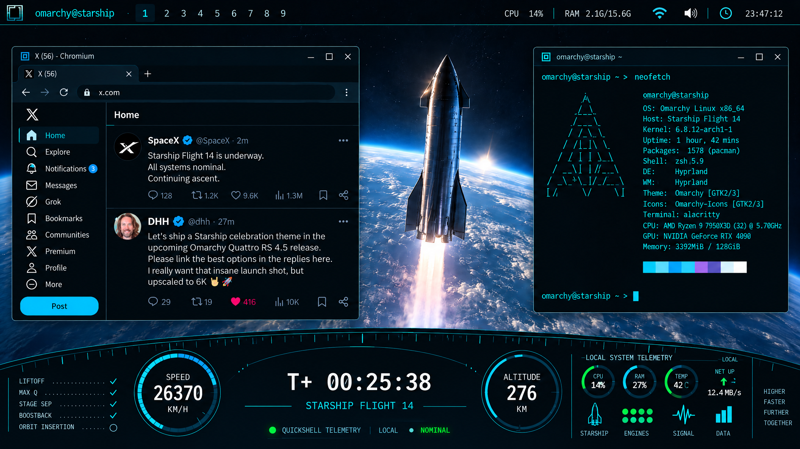

# Omarchy Starship Theme

A dark aerospace theme for Omarchy inspired by Starship mission-control consoles: orbital blues, cyan instrumentation, restrained amber status lights, and high-contrast terminal text.



This preview shows the intended complete experience: the Starship desktop theme combined with the optional local-system telemetry HUD.

## Install

```bash
omarchy theme install https://github.com/neshath/omarchy-starship-theme
```

Then choose **Style → Theme → Starship** and select the included `starship-orbit` background.

## Contents

- `colors.toml` — the Omarchy palette used to generate app and shell styling.
- `backgrounds/starship-orbit.webp` — the included desktop background.
- `preview.png` — theme-switcher preview.
- `preview-unlock.png` — unlock preview artwork.
- `icons.theme` — Yaru Blue file-manager icons.

The bottom telemetry console is intentionally distributed separately as the [Omarchy Starship HUD plugin](https://github.com/neshath/omarchy-starship-hud), because a theme should change appearance and assets, while executable Quickshell code belongs in a plugin.

## Compatibility and safety

Target: Omarchy Quattro and later. This repository contains visual theme files only; it does not include Lua, terminal launch configuration, symlinks, network services, or install hooks.

## License

MIT. See [LICENSE](LICENSE).
